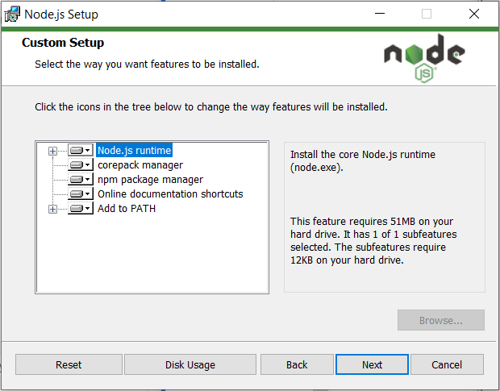
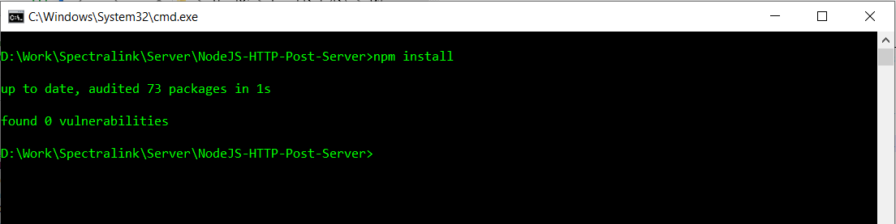
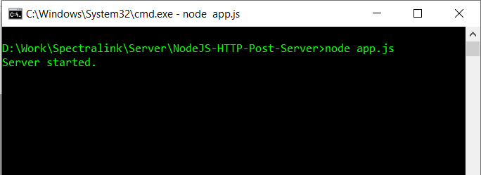
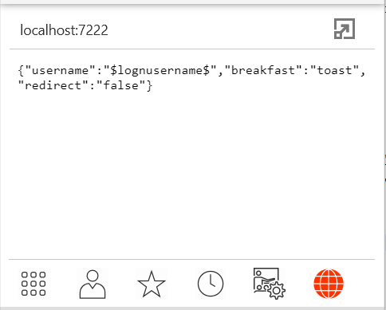
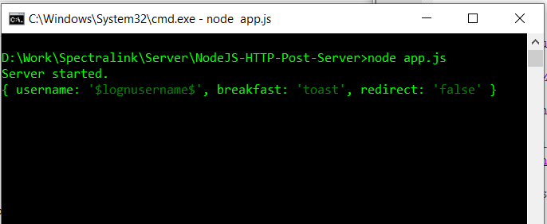

# NodeJS-HTTP-Post-Server
 An HTTP server for testing post params.
 
## Setup
First, you must install node.js here: https://nodejs.org/en/download/, any version should do.
Make sure to include all of the defaults in the installation (mostly so that NPM is included}:


Next, you can download the repository to your machine. Open a command prompt and navigate to the directory with the downloaded code.

If node was installed, you should be able to type the command ```npm install```.


It should install some packages. (namely 'express' and 'socket.io').

After, you can use the command ```node app.js```. 

You should see the server start. By default, the server is started on ```http://localhost:7222/```.
You can change the port by changing the "properties.json" file. (You can also change the hostname, but that won't do anything).



Now, you can point anything to send a post request to ```http://localhost:7222/```, and they will receive back the post parameters in the request body:

(Note that on a stretto, you would have ```desk.feature.webBrowser.urlX = http://localhost:7222/``` where X is 1,2 ect. You should then see what is in ```...webBrowser.postParamsX=``` appear if that webbrowsertab is enabled.)

You will also see the body logged on the console.

